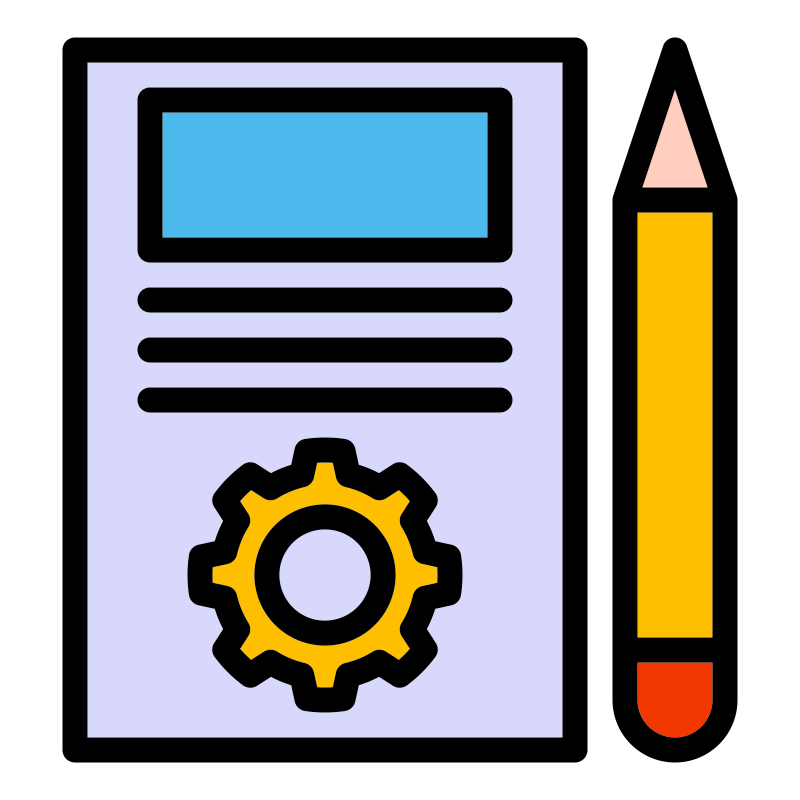

# Job Tracker

A comprehensive application to help software developers, students, and job seekers track and manage their job applications throughout the hiring process.



## Overview

Job Tracker is a full-stack web application designed to help users organize their job search process. It allows users to keep track of job applications, interview rounds, salaries, and personal notes about each opportunity. The application also features AI-powered insights to help users improve their application strategy.

### Key Features

- **User Authentication**: Secure signup, login, and profile management
- **Job Application Management**: Add, edit, and delete job applications
- **Interview Tracking**: Record multiple interview rounds for each job
- **Dashboard View**: Get a visual overview of all your job applications
- **Dark/Light Mode**: Choose your preferred UI theme
- **AI-Powered Insights**: Leverage Gemini AI to get suggestions and improvements for your job search
- **Review System**: Add personal notes and reflections about each job application
- **Responsive Design**: Works seamlessly on desktop and mobile devices

## Who Is This For?

### Software Developers

- Track coding assessments and technical interviews
- Organize job applications across multiple companies
- Document technical requirements for each position
- Compare salary offers and benefits

### Students

- Track internship applications
- Organize applications by academic term
- Keep notes about company culture and learning opportunities
- Prepare for interviews with historical data

### Job Seekers

- Centralize all job application data in one place
- Monitor application status and progress
- Remember important details about each company
- Plan follow-ups and next steps efficiently

## Technology Stack

### Frontend

- React 19
- React Router 7
- Material UI 7
- Tailwind CSS 4
- Framer Motion
- Axios
- Google Generative AI (Gemini)

### Backend

- Express.js 5
- PostgreSQL
- Sequelize ORM
- JWT Authentication
- bcrypt for password hashing

## Getting Started

### Prerequisites

- Node.js (v18 or higher)
- PostgreSQL database
- Google Gemini API key (for AI features)

### Installation

1. Clone the repository:

   ```
   git clone https://github.com/yourusername/job-tracker.git
   cd job-tracker
   ```

2. Install dependencies for both client and server:

   ```
   # Install server dependencies
   cd server
   npm install

   # Install client dependencies
   cd ../client
   npm install
   ```

3. Set up environment variables:

   Create a `.env` file in the server directory with the following:

   ```
   PORT=3001
   JWT_SECRET=your_jwt_secret
   NODE_ENV=development
   ```

   Create a `.env` file in the client directory with the following:

   ```
   VITE_API_URL=http://localhost:3001
   VITE_GEMINI_API_KEY=your_gemini_api_key
   ```

4. Set up the database:

   ```
   # In the server directory
   npx sequelize-cli db:create
   npm run migrate
   ```

5. Start the application:

   ```
   # Start the server (from server directory)
   npm start

   # Start the client (from client directory)
   npm run dev
   ```

6. Open your browser and navigate to `http://localhost:5173`

## Usage

1. **Sign up** for a new account or **log in** with existing credentials
2. Navigate to the **dashboard** to view all your job applications
3. Click the **"+"** button to add a new job application
4. Fill in the job details including title, company, location, and salary
5. Add interview rounds as they occur
6. Use the AI feature to get insights about your application
7. Add personal reviews and notes about each job opportunity
8. Toggle between dark and light mode as preferred

## Contributing

Contributions are welcome! Here's how you can contribute to the project:

1. Fork the repository
2. Create a new branch (`git checkout -b feature/your-feature-name`)
3. Make your changes
4. Commit your changes (`git commit -m 'Add some feature'`)
5. Push to the branch (`git push origin feature/your-feature-name`)
6. Open a Pull Request

Please make sure to update tests as appropriate and follow the code style of the project.

## Development Roadmap

- **Analytics Dashboard**: Visual representations of application statistics
- **Email Notifications**: Reminders for follow-ups and upcoming interviews
- **Resume Storage**: Attach and manage different versions of resumes
- **Calendar Integration**: Sync interview schedules with Google Calendar
- **Mobile App**: Native mobile experience for on-the-go job tracking

## License

This project is licensed under the MIT License - see the LICENSE file for details.

## Acknowledgments

- The React team for their amazing frontend library
- The Sequelize team for their powerful ORM
- Google for their Generative AI API
- All contributors who have helped improve this project
